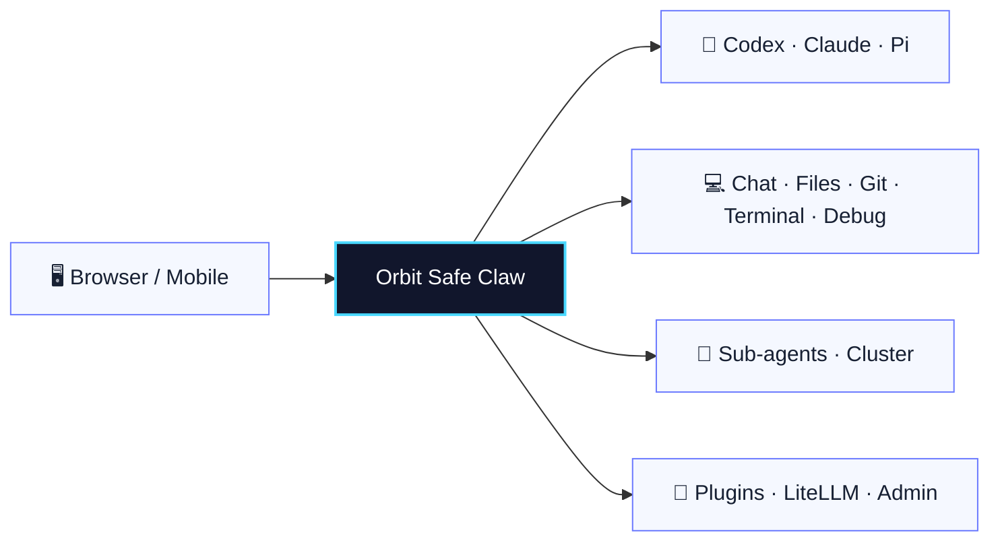

<p align="center">
  
</p>

<p align="center">
  <a href="README.md">简体中文</a> · <strong>English</strong>
</p>

<h1 align="center">Orbit Safe Claw</h1>

<p align="center">
  Current version: `1.4.11` · Documentation updated: `2026-08-01`
</p>

<p align="center">
  <strong>A self-hosted, multi-workspace AI development console for controlling local Codex, Claude, and Pi from your browser.</strong>
</p>

<p align="center">
  Chat · Files · Git · Terminal · Debug · Plugins · Multi-agent Cluster
</p>

<p align="center">
  <a href="#quick-start">Quick Start</a> ·
  <a href="https://github.com/Augustusjk2008/telegram-cli-bot/releases/latest">Download</a> ·
  <a href="#feature-tour">Feature Tour</a> ·
  <a href="#advanced-configuration">Advanced Configuration</a> ·
  <a href="#license-branding-and-contributions">License</a> ·
  <a href="https://github.com/Augustusjk2008/telegram-cli-bot/issues">Report an Issue</a>
</p>

<p align="center">
  <a href="https://github.com/Augustusjk2008/telegram-cli-bot/releases/latest"></a>
  
  
  
  <a href="LICENSE"></a>
</p>

> [!NOTE]
> Orbit Safe Claw does not host models or replace Codex, Claude, or Pi. It connects local AI CLIs, workspaces, and development tools to a remotely accessible web workbench, making multiple repositories, bots, sessions, and sub-agents easier to manage from one place.

## At a Glance



<table>
  <tr>
    <td width="33%" valign="top"><strong>🤖 Multiple Bots and Sessions</strong><br><br>Each bot can use its own CLI, working directory, execution mode, and sessions, while user and agent scopes remain isolated.</td>
    <td width="33%" valign="top"><strong>🧰 Integrated Development Workbench</strong><br><br>Chat, edit files, inspect Git, use terminals, debug, and preview plugin content without constantly switching windows or context.</td>
    <td width="33%" valign="top"><strong>🧭 Sub-agents and Clusters</strong><br><br>Split review, implementation, and verification across sub-agents, routing rules, and cluster workflows, then collect results centrally.</td>
  </tr>
  <tr>
    <td valign="top"><strong>⚡ CLI and Native Execution</strong><br><br>Codex and Claude use the regular CLI stream; the native Pi agent uses AG-UI and preserves tool calls, permission requests, and context usage.</td>
    <td valign="top"><strong>🧩 Extensible Plugin Runtime</strong><br><br>Use <code>plugin.json</code> to add file viewers, settings pages, background processes, and full session-oriented views.</td>
    <td valign="top"><strong>🔒 Local-first and Self-managed</strong><br><br>Keep workspaces, sessions, configuration, and runtime data on your own devices, with user permissions, announcements, and update management included.</td>
  </tr>
</table>

## Quick Start

### Windows: Portable Edition Recommended

> [!TIP]
> The Windows portable package includes Python, Node.js, Git, the Pi CLI, Pi extensions, and the built frontend. Extract it and start immediately. Codex and Claude CLIs are not bundled; install either CLI locally before using it.

1. Open [GitHub Releases](https://github.com/Augustusjk2008/telegram-cli-bot/releases/latest).
2. Download `orbit-safe-claw-windows-x64-<version>.zip` and extract it to a writable directory.
3. Double-click `start.bat`, or run:

   ```powershell
   .\start.bat
   ```

4. Open the web address shown in the console. The default is `http://127.0.0.1:8765`, and the login token is stored as `WEB_API_TOKEN` in `.env`.

For the conventional installer flow, download `orbit-safe-claw-windows-x64-installer-<version>.zip`, extract it, and run `install.bat`.

### Linux / macOS

| Platform | Installation |
|---|---|
| Linux x64 | Download `orbit-safe-claw-linux-x64-<version>.tar.gz`, extract it, then run `bash install.sh` |
| macOS | Download `orbit-safe-claw-macos-universal-<version>.tar.gz`, extract it, then run `bash install.sh` |

Extract into a dedicated directory:

```bash
mkdir orbit-safe-claw
tar -xzf orbit-safe-claw-<platform>-<version>.tar.gz -C orbit-safe-claw
cd orbit-safe-claw
bash install.sh
bash start.sh
```

Linux and macOS require Python 3.10-3.13 (3.12 recommended; 3.14 is not yet supported), Node.js 22+, and Git. The native Pi agent also requires bash. Codex and Claude CLIs are not bundled.

<details>
<summary><strong>Install from a source snapshot</strong></summary>

Windows:

```powershell
$zip="$env:TEMP\orbit-safe-claw.zip"
Invoke-WebRequest "https://github.com/Augustusjk2008/telegram-cli-bot/archive/refs/heads/master.zip" -OutFile $zip
Expand-Archive $zip -DestinationPath . -Force
Set-Location .\telegram-cli-bot-master
.\install.bat
```

Linux/macOS:

```bash
curl -L https://github.com/Augustusjk2008/telegram-cli-bot/archive/refs/heads/master.tar.gz \
  | tar -xz
cd telegram-cli-bot-master
bash install.sh
```

</details>

## Feature Tour

### Multi-workspace Agent Control

- Bind the primary bot and managed bots to different repositories, CLIs, and working directories.
- Web sessions are isolated by user, bot, and agent to prevent cross-workspace session leakage.
- Regular Codex and Claude CLI sessions retain streaming text, status events, traces, and completion events.
- The native Pi agent retains sessions, tool calls, permission requests, context usage, and execution details.

### Desktop Workbench

- **Chat**: regular CLI and native-agent conversations, history recovery, execution details, and context status.
- **Files**: file tree, editor, previews, tabs, and language-service navigation.
- **Git**: repository status, diffs, commit history, and workspace operations.
- **Terminal**: persistent multi-tab web terminals, with an independent shell and owner for every tab.
- **Debug**: debugging entry points for Python, C/C++, Godot, and generic DAP adapters.
- **Plugins**: extensible viewers for PDF, DOCX, PPTX, CSV, Vivado waveforms, and more.

### Sub-agent and Cluster Collaboration

- CLI bots support sub-agents, `@agent_id` routing, cluster templates, and model tiers.
- Cluster tools cover task creation, status checks, polling, and message waiting.
- Non-cluster chats bind to one active agent; cluster mode distributes subtasks through explicit routing.

### Administration and Extensions

- Admin Center manages user permissions, invite codes, announcements, updates, and runtime status.
- An optional LiteLLM gateway provides model aliases, multi-upstream routing, and OpenAI-compatible endpoints.
- Codex CLI usage can be aggregated by local calendar day, provider, and model.
- Cloudflare quick tunnels and fixed public forwarding support controlled mobile access.

## Support Matrix

### Release Packages

| Package | Best for | Runtime |
|---|---|---|
| Windows portable | Fast setup and portable/offline use | Bundles Python, Node.js, Git, Pi CLI, and frontend assets |
| Windows installer | Conventional local installation | Installer checks and prepares dependencies |
| Linux x64 | Self-hosting on Linux | Uses system Python, Node.js, and Git |
| macOS universal | macOS source package | Uses system Python, Node.js, and Git |

### Execution Modes

| Mode | Primary target | Transport and presentation |
|---|---|---|
| `cli` | Codex, Claude | Legacy SSE: text, status, trace, and completion events |
| `native_agent` | Pi | AG-UI: tools, permissions, execution details, context, and native sessions |
| Cluster | Per bot/agent configuration | Subtask routing, polling, result messages, and model tiers |

## Security Boundary

> [!WARNING]
> Orbit Safe Claw can read and write workspace files, execute terminal commands, and operate Git. Never expose an unprotected instance directly to the public internet.

- Use a strong random value for `WEB_API_TOKEN` and limit administrator privileges.
- Put public access behind a trusted reverse proxy, firewall, and TLS. The reverse proxy must support WebSocket.
- Never commit `.env`, a real `managed_bots.json`, or runtime data under `~/.tcb/`.
- Keep `TCB_DATA_DIR` outside the workspace so workspace rollback cannot affect runtime state.
- Closing a terminal tab terminates its shell. Old background terminal sessions do not survive a web-service restart.

## Basic Configuration

After the first installation, verify at least:

```env
CLI_TYPE=codex
CLI_PATH=codex
WORKING_DIR=C:\Users\YourName\project
WEB_ENABLED=true
WEB_HOST=0.0.0.0
WEB_PORT=8765
WEB_API_TOKEN=<strong-random-token>
```

Runtime data is stored in `~/.tcb/orbit-safe-claw` by default. Override it with `TCB_DATA_DIR`.

<details>
<summary><strong>Manage multiple bots</strong></summary>

Create a local `managed_bots.json` based on `managed_bots.example.json`:

```json
{
  "bots": [
    {
      "alias": "repo2",
      "cli_type": "codex",
      "cli_path": "codex",
      "working_dir": "C:/work/repo2",
      "enabled": true
    }
  ]
}
```

</details>

## Advanced Configuration

<details>
<summary><strong>Fixed public address with an frp reverse proxy</strong></summary>

A server with a fixed public IP can forward traffic to machines behind NAT through frp. Every machine must have a unique node path, and the complete `/node/<node-id>/` prefix must be preserved:

```text
http://<public-ip>:18088/node/<node-id>/
```

Local `.env`:

```env
TCB_NODE_ID=my-laptop
WEB_BASE_PATH=/node/my-laptop
WEB_PUBLIC_URL=http://<public-ip>:18088/node/my-laptop
WEB_FIXED_PUBLIC_FORWARD_ENABLED=true
WEB_FIXED_PUBLIC_FORWARD_URL=http://<public-ip>:18088/node/my-laptop
TCB_HUB_FRPS_PORT=7000
TCB_HUB_FRPS_TOKEN=<frps-token>
TCB_HUB_NODE_TOKEN=<random-node-token>
TCB_HUB_FRPC_PATH=frpc
TCB_HUB_FRPC_AUTOSTART=true
```

`frps.toml` on the fixed-IP server:

```toml
bindPort = 7000
vhostHTTPPort = 18765
auth.token = "<frps-token>"
```

Nginx must preserve the node path and support WebSocket:

```nginx
map $http_upgrade $connection_upgrade {
  default upgrade;
  '' close;
}

server {
  listen 18088;

  location /node/my-laptop/ {
    proxy_pass http://127.0.0.1:18765;
    proxy_http_version 1.1;
    proxy_set_header Host $host;
    proxy_set_header X-Real-IP $remote_addr;
    proxy_set_header X-Forwarded-For $proxy_add_x_forwarded_for;
    proxy_set_header X-Forwarded-Proto $scheme;
    proxy_set_header Upgrade $http_upgrade;
    proxy_set_header Connection $connection_upgrade;
  }
}
```

Allow inbound traffic on `18088` and `7000`. `WEB_BASE_PATH` must match the reverse-proxy path exactly. Rebuild the frontend and restart the web service after changing the path.

</details>

<details>
<summary><strong>Install the native Pi agent without the portable package</strong></summary>

Non-portable installations require Node.js 22+, Git, and bash. Install the pinned packages:

```bash
npm install -g @earendil-works/pi-coding-agent@0.74.2 pi-workspace-history@0.2.2
```

Configure at least:

```env
NATIVE_AGENT_ENABLED=true
NATIVE_AGENT_PI_COMMAND=pi
```

Pi extensions live in `~/.pi/agent/extensions` by default. If you use `PI_AGENT_SETTINGS` or `NATIVE_AGENT_PI_HOME`, place `workspace-history.ts` and the repository's `bot/cluster/pi_extension/tcb-cluster.ts` in the extensions directory that is actually active. On Windows, Pi's `shellPath` should point to Git Bash.

A Pi session is bound to the working directory, model, Pi agent, and reasoning effort. Changing any of these creates a new session and a new workspace-history rollback chain.

</details>

<details>
<summary><strong>Optional LiteLLM gateway</strong></summary>

The LiteLLM gateway is not required by regular CLI execution. When it is disabled, Codex and Claude continue to connect directly to their own providers.

Each route can define a model alias, LiteLLM model, upstream URL, secret, extra parameters, and one of three endpoint modes: `auto`, `chat_completions`, or `responses`. Saved changes are applied without restarting the main web service, and status APIs never echo upstream secrets.

Configuration and logs are stored under `~/.tcb/orbit-safe-claw/transfer` by default.

</details>

<details>
<summary><strong>Codex CLI usage statistics</strong></summary>

Collection can be enabled or disabled immediately in Admin Center. It is disabled by default and only measures regular Codex CLI processes launched by Orbit after collection is enabled. It does not backfill history or include Claude, Pi, native agents, LiteLLM Transfer, inline completion, or manually launched terminal processes.

Usage is aggregated by date, provider, and model. Data is stored in `~/.tcb/orbit-safe-claw/codex-usage/usage.sqlite3` by default and does not store per-turn prompts, authentication headers, or API keys.

</details>

<details>
<summary><strong>Choose the web terminal shell</strong></summary>

```env
WEB_TERMINAL_SHELL_PATH=/usr/bin/zsh
```

Windows example:

```env
WEB_TERMINAL_SHELL_PATH=C:\Program Files\PowerShell\7\pwsh.exe
```

This setting only controls the shell inside the web xterm. It does not launch an external GUI terminal.

</details>

## Updates

Settings and Admin Center can check GitHub Releases and download updates. A downloaded update is applied the next time the application starts or restarts.

The generated `.env` includes:

```env
APP_UPDATE_REPOSITORY=Augustusjk2008/telegram-cli-bot
```

To use your own release repository, change the value to the corresponding `owner/repo`.

## Project Layout

```text
.
├─ bot/                    # Python backend, Web API, bots, native agents, plugins
├─ front/                  # React/Vite workbench frontend
├─ examples/plugins/       # Example plugins and file viewers
├─ tests/                  # Backend and integration tests
├─ scripts/                # Installation, build, and helper scripts
├─ deploy/                 # Deployment files
├─ install.*               # Installation entry points
├─ start.*                 # Startup entry points
├─ managed_bots.example.json
├─ LICENSE / NOTICE        # Apache-2.0 and copyright notice
├─ THIRD_PARTY_NOTICES.md  # Third-party license inventory
├─ TRADEMARKS.md           # Project name and logo policy
├─ CONTRIBUTING.md         # Contribution guide and licensing terms
└─ AGENTS.md               # Coding-agent conventions
```

Local runtime files include `.env`, `managed_bots.json`, `front/dist/`, and `~/.tcb/orbit-safe-claw`. Do not commit real configuration or runtime data.

## Development and Verification

```bash
# Backend
python -m bot
python -m pytest tests -q

# Frontend
cd front
npm run test:gate
npm run lint
npm run build
```

Windows is the primary platform, with Linux and macOS installation and startup scripts maintained alongside it. Layout changes should include browser-level checks. Release-package changes should run the backend test suite, frontend gate, lint, and production build.

## License, Branding, and Contributions

Original project code, documentation, and logo artwork are licensed under the [Apache License 2.0](LICENSE); see [NOTICE](NOTICE) for copyright attribution. The license permits commercial use, modification, and redistribution and includes an express patent grant, subject to its notice, change-marking, and other conditions.

Third-party components remain subject to their own licenses; see [THIRD_PARTY_NOTICES.md](THIRD_PARTY_NOTICES.md). Production builds generate `front/dist/THIRD_PARTY_LICENSES.txt` from the frontend modules actually emitted and include it in release archives. The `Orbit Safe Claw` name and the logos in `front/public/assets/app-logo*.svg` are project marks. The copyright license for the logo files does not confer trademark rights, endorsement, or official status, and Apache License 2.0 does not grant permission to brand a fork or derivative product with them. See [TRADEMARKS.md](TRADEMARKS.md) for permitted uses and permission requests.

Read [CONTRIBUTING.md](CONTRIBUTING.md) before submitting changes. Unless explicitly stated otherwise in writing, contributions intentionally submitted for inclusion are provided under Apache License 2.0.

## Getting Help

- Downloads and versions: [GitHub Releases](https://github.com/Augustusjk2008/telegram-cli-bot/releases)
- Bugs and feature requests: [GitHub Issues](https://github.com/Augustusjk2008/telegram-cli-bot/issues)
- Configuration examples: `.env.example` and `managed_bots.example.json`
- Testing policy: `docs/testing-policy.md`

If Orbit Safe Claw helps you, consider leaving a Star or sharing your use case through an Issue.
