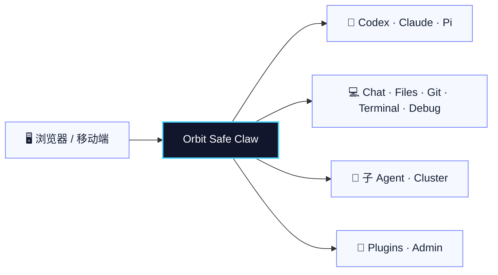

<p align="center">
  
</p>

<p align="center">
  <strong>简体中文</strong> · <a href="README.en.md">English</a>
</p>

<h1 align="center">Orbit Safe Claw</h1>

<p align="center">
  <strong>在浏览器中统一操控本地 Codex、Claude 与 Pi 的多工作区 AI 开发控制台。</strong>
</p>

<p align="center">
  Chat · Files · Git · Terminal · Debug · Plugins · Multi-agent Cluster
</p>

<p align="center">
  <a href="#快速开始">快速开始</a> ·
  <a href="https://github.com/Augustusjk2008/telegram-cli-bot/releases/latest">下载最新版</a> ·
  <a href="#功能导览">功能导览</a> ·
  <a href="#高级配置">高级配置</a> ·
  <a href="#开源协议品牌与贡献">开源协议</a> ·
  <a href="https://github.com/Augustusjk2008/telegram-cli-bot/issues">反馈问题</a>
</p>

<p align="center">
  <a href="https://github.com/Augustusjk2008/telegram-cli-bot/releases/latest"></a>
  
  
  
  <a href="LICENSE"></a>
</p>

> [!NOTE]
> Orbit Safe Claw 不托管模型，也不替代 Codex、Claude 或 Pi。它把本机 AI CLI、工作区和开发工具接入一个可远程访问的 Web 工作台，让多个仓库、Bot、会话和子 Agent 更容易统一管理。

## 一眼看懂



<table>
  <tr>
    <td width="33%" valign="top"><strong>🤖 多 Bot 与多会话</strong><br><br>每个 Bot 绑定自己的 CLI、工作目录、执行模式和会话；Agent 作用域相互隔离，获准访问同一 Bot 的 Web 账号共享对话。</td>
    <td width="33%" valign="top"><strong>🧰 一体化开发工作台</strong><br><br>在同一页面完成聊天、文件编辑、Git、终端、调试和插件预览，减少窗口与上下文切换。</td>
    <td width="33%" valign="top"><strong>🧭 子 Agent 与集群</strong><br><br>通过子 Agent、路由和集群模式拆分审查、实现与验证任务，并统一回收结果。</td>
  </tr>
  <tr>
    <td valign="top"><strong>⚡ CLI 与原生执行</strong><br><br>Codex、Claude 使用普通 CLI 流；Pi 原生 Agent 使用 AG-UI，保留工具调用、权限请求和上下文用量。</td>
    <td valign="top"><strong>🧩 可扩展插件运行时</strong><br><br>通过 <code>plugin.json</code> 扩展文件视图、配置页和后台进程，支持重型 session 视图。</td>
    <td valign="top"><strong>🔒 本地优先、自主管理</strong><br><br>工作区、会话、配置和运行数据保留在自己的设备上，并提供用户权限、公告和更新管理。</td>
  </tr>
</table>

## 快速开始

### Windows：推荐使用绿色版

> [!TIP]
> Windows 绿色版内置 Python、Node.js、Git、Pi CLI、Pi 扩展和前端产物；解压即可启动。它不内置 Codex 或 Claude CLI，如需使用请先在本机安装对应 CLI。

1. 打开 [GitHub Releases](https://github.com/Augustusjk2008/telegram-cli-bot/releases/latest)。
2. 下载 `orbit-safe-claw-windows-x64-<version>.zip` 并解压到可写目录。
3. 双击 `start.bat`，或在终端执行：

   ```powershell
   .\start.bat
   ```

4. 按控制台输出打开 Web 地址。默认地址为 `http://127.0.0.1:8765`，登录口令保存在 `.env` 的 `WEB_API_TOKEN`。

需要传统安装流程时，下载 `orbit-safe-claw-windows-x64-installer-<version>.zip`，解压后运行 `install.bat`。

### Linux / macOS

| 平台 | 安装方式 |
|---|---|
| Linux x64 | 下载 `orbit-safe-claw-linux-x64-<version>.tar.gz`，解压后运行 `bash install.sh` |
| macOS | 下载 `orbit-safe-claw-macos-universal-<version>.tar.gz`，解压后运行 `bash install.sh` |

推荐解压到独立目录：

```bash
mkdir orbit-safe-claw
tar -xzf orbit-safe-claw-<platform>-<version>.tar.gz -C orbit-safe-claw
cd orbit-safe-claw
bash install.sh
bash start.sh
```

Linux/macOS 需要 Python 3.10+、Node.js 18+ 和 Git；Pi 原生 Agent 需要 Node.js 22+ 和 bash。

<details>
<summary><strong>从源码快照安装</strong></summary>

Windows：

```powershell
$zip="$env:TEMP\orbit-safe-claw.zip"
Invoke-WebRequest "https://github.com/Augustusjk2008/telegram-cli-bot/archive/refs/heads/master.zip" -OutFile $zip
Expand-Archive $zip -DestinationPath . -Force
Set-Location .\telegram-cli-bot-master
.\install.bat
```

Linux/macOS：

```bash
curl -L https://github.com/Augustusjk2008/telegram-cli-bot/archive/refs/heads/master.tar.gz \
  | tar -xz
cd telegram-cli-bot-master
bash install.sh
```

</details>

## 功能导览

### 多工作区 Agent 控制

- 主 Bot 与托管 Bot 可绑定不同仓库、CLI 和工作目录。
- Web session 按 Bot、共享用户域和 Agent 隔离；获准访问同一 Bot 的 Web 账号共享对应 Agent 对话。
- Codex 与 Claude 普通 CLI 保留流式正文、状态、trace 和完成态。
- Pi 原生 Agent 保留 session、工具调用、权限请求、上下文用量和过程详情。

### Desktop Workbench

- **Chat**：普通 CLI 与原生 Agent 对话、历史恢复、过程详情和上下文状态。
- **Files**：文件树、编辑器、预览、多标签和语言服务导航。
- **Git**：状态、diff、提交历史与工作区操作。
- **Terminal**：持久化多标签 Web 终端，每个标签使用独立 shell 和 owner。
- **Debug**：面向 Python、C/C++、Godot 和通用 DAP 的调试入口。
- **Plugins**：PDF、DOCX、PPTX、CSV、Vivado waveform 等可扩展视图。

### 子 Agent 与集群协作

- 普通聊天可按显式 `agent_id` 进入隔离的 Agent 会话；集群模板用于准备 Bot 级并行槽位和模型档位。
- 集群工具覆盖动态编组、状态查询、子 Agent 新会话、异步任务创建、轮询和消息等待。
- 启用 Bot 级集群后，主 Agent 通过统一的 `tcb-cluster` 工具面委派子任务；Codex、Claude 使用 stdio MCP，Pi 使用扩展适配同一 bridge。

### 管理与扩展

- Admin Center 管理用户权限、邀请码、公告、更新和运行状态。
- Codex CLI 用量统计可按本地自然日、Provider 和模型聚合展示。
- Cloudflare quick tunnel 和固定公网转发可用于受控的移动端访问。

## 支持矩阵

### 发布包

| 发布包 | 适用场景 | 运行时 |
|---|---|---|
| Windows 绿色版 | 最快体验、离线携带 | 内置 Python、Node.js、Git、Pi CLI 与前端产物 |
| Windows 安装版 | 常规本机安装 | 由安装脚本检查并准备依赖 |
| Linux x64 | Linux 自托管 | 使用本机 Python、Node.js、Git |
| macOS universal | macOS 源码包 | 使用本机 Python、Node.js、Git |

### 执行模式

| 模式 | 主要目标 | 传输与展示 |
|---|---|---|
| `cli` | Codex、Claude | Legacy SSE：正文、状态、trace、完成态 |
| `native_agent` | Pi | AG-UI：工具、权限、过程、上下文和原生 session |
| Cluster | 按 Bot 配置、按主会话编组 | 动态编组、异步委派、轮询、消息回告和模型档位 |

## 安全边界

> [!WARNING]
> Orbit Safe Claw 可以读写工作区、执行终端命令并操作 Git。不要把未加保护的实例直接暴露到公网。

- 为 `WEB_API_TOKEN` 使用高强度随机值，并限制管理员账号权限。
- 公网访问应经过可信反向代理、防火墙和 TLS；反向代理必须支持 WebSocket。
- `.env`、真实 `managed_bots.json` 和 `~/.tcb/` 运行数据不得提交到仓库。
- 建议将 `TCB_DATA_DIR` 放在工作区之外，避免 workspace rollback 影响运行状态。
- 终端标签关闭时会终止对应 shell；Web 服务重启后，旧后台终端会话不会继续保留。

## 基本配置

首次安装后至少确认：

```env
CLI_TYPE=codex
CLI_PATH=codex
WORKING_DIR=C:\Users\YourName\project
WEB_ENABLED=true
WEB_HOST=0.0.0.0
WEB_PORT=8765
WEB_API_TOKEN=<高强度随机口令>
```

运行态数据默认位于 `~/.tcb/orbit-safe-claw`，可通过 `TCB_DATA_DIR` 覆盖。

<details>
<summary><strong>托管多个 Bot</strong></summary>

参考 `managed_bots.example.json` 创建本地 `managed_bots.json`：

```json
{
  "bots": [
    {
      "alias": "repo2",
      "cli_type": "codex",
      "cli_path": "codex",
      "working_dir": "C:/work/repo2",
      "enabled": true
    }
  ]
}
```

</details>

## 高级配置

### 模型费用估算

上下文详情弹窗显示按 `bot/data/model_prices.csv` 计算的费用。CSV 单价单位为每百万 token，`currency` 为币种代码（默认表使用 USD）；普通输入、缓存读取、缓存写入和输出分别计价，reasoning 不重复计入输出。Claude 的 `cache_write_per_million` 对应 5 分钟缓存写入，可选 `cache_write_1h_per_million` 对应 1 小时；上游未区分缓存时长时使用普通缓存写入单价。

模型按 CSV 的 `model` 精确匹配；Pi 的 `provider/model` 优先匹配完整 ID，再匹配模型名。新模型、别名或带日期的模型 ID 可直接新增一行。未匹配、价格表无效或用量不完整时不显示费用。也可通过 `.env` 的 `MODEL_PRICES_FILE` 指定自己的 CSV 路径；修改 CSV 后下一次计价自动读取，已保存消息保留当时的费用快照。

Codex 显示上游报告的**会话累计估算费用**，统一按当前计价模型的单价计算，不做跨轮差分，各轮快照不可再相加。Claude 显示本次 CLI 调用的主模型用量费用，Pi 汇总本轮已完成的模型调用；集群子 agent 的费用保存在各自回复里，不额外汇入主回复。

默认表按 2026-09-05 核对的常用模型官方标准单价填写，来源保存在 `source_url` 列。这里是按固定单价估算的 token 费用，不代表订阅套餐实际扣款；长上下文、加速模式、地区和工具调用等额外计费规则不自动套用，使用渠道价格时请自行调整 CSV。

<details>
<summary><strong>固定公网地址与 frp 反向代理</strong></summary>

固定 IP 服务器可通过 frp 转发内网机器。每台机器必须使用独立节点路径，并完整保留 `/node/<节点 ID>/` 前缀：

```text
http://<固定IP>:18088/node/<节点ID>/
```

本机 `.env`：

```env
TCB_NODE_ID=my-laptop
WEB_BASE_PATH=/node/my-laptop
WEB_PUBLIC_URL=http://<固定IP>:18088/node/my-laptop
WEB_FIXED_PUBLIC_FORWARD_ENABLED=true
WEB_FIXED_PUBLIC_FORWARD_URL=http://<固定IP>:18088/node/my-laptop
TCB_HUB_FRPS_PORT=7000
TCB_HUB_FRPS_TOKEN=<frps-token>
TCB_HUB_NODE_TOKEN=<random-node-token>
TCB_HUB_FRPC_PATH=frpc
TCB_HUB_FRPC_AUTOSTART=true
```

固定 IP 服务器的 `frps.toml`：

```toml
bindPort = 7000
vhostHTTPPort = 18765
auth.token = "<frps-token>"
```

Nginx 必须保留节点路径并支持 WebSocket：

```nginx
map $http_upgrade $connection_upgrade {
  default upgrade;
  '' close;
}

server {
  listen 18088;

  location /node/my-laptop/ {
    proxy_pass http://127.0.0.1:18765;
    proxy_http_version 1.1;
    proxy_set_header Host $host;
    proxy_set_header X-Real-IP $remote_addr;
    proxy_set_header X-Forwarded-For $proxy_add_x_forwarded_for;
    proxy_set_header X-Forwarded-Proto $scheme;
    proxy_set_header Upgrade $http_upgrade;
    proxy_set_header Connection $connection_upgrade;
  }
}
```

公网服务器需放通 `18088`、`7000`。`WEB_BASE_PATH` 必须与反代路径完全一致；修改路径后重新构建前端并重启 Web。

</details>

<details>
<summary><strong>非绿色版安装 Pi 原生 Agent</strong></summary>

非绿色版依赖 Node.js 22+、Git 和 bash。安装固定版本：

```bash
npm install -g @earendil-works/pi-coding-agent@0.74.2 pi-workspace-history@0.2.2
```

启用原生 Agent 必须配置：

```env
NATIVE_AGENT_ENABLED=true
```

`NATIVE_AGENT_PI_COMMAND` 默认是 `pi`，仅在 PATH 无法解析或使用自定义命令时设置。

Pi 扩展默认位于 `~/.pi/agent/extensions`。使用 `PI_AGENT_SETTINGS` 或 `NATIVE_AGENT_PI_HOME` 时，应把 `workspace-history.ts` 和仓库内 `bot/cluster/pi_extension/tcb-cluster.ts` 放入实际生效的 extensions 目录。当前管理页安装助手只识别 `PI_AGENT_SETTINGS` 或系统 HOME；仅设置 `NATIVE_AGENT_PI_HOME` 时需手动确认目标目录。Windows 的 Pi `shellPath` 建议指向 Git Bash。

Pi runtime 和持久化 session 当前以 Bot/用户/Agent 的 conversation 与工作目录为主要作用域。在同一 conversation 内仅修改模型、Pi Agent 或推理强度，不会自动轮换已有 Pi session 和 rollback 链；需要完全隔离时请新建会话。

</details>

<details>
<summary><strong>Codex CLI 用量统计</strong></summary>

管理中心可即时开启或关闭采集。功能默认关闭，只统计启用后由 Orbit 启动的普通 Codex CLI 进程，不回填历史，也不统计 Claude、Pi、原生 Agent、行内补全或手工终端进程。

统计按日期、Provider 和模型聚合，数据默认保存在 `~/.tcb/orbit-safe-claw/codex-usage/usage.sqlite3`，不会保存逐轮提示词、认证头或 API 密钥。

</details>

<details>
<summary><strong>指定 Web 终端 Shell</strong></summary>

```env
WEB_TERMINAL_SHELL_PATH=/usr/bin/zsh
```

Windows 示例：

```env
WEB_TERMINAL_SHELL_PATH=C:\Program Files\PowerShell\7\pwsh.exe
```

该配置只影响 Web xterm 内运行的 shell，不会启动外部 GUI 终端窗口。

</details>

## 更新

设置页和 Admin Center 会从 GitHub Releases 检查、下载更新。下载完成后，更新在下次启动或重启时应用。

首次安装生成的 `.env` 默认包含：

```env
APP_UPDATE_REPOSITORY=Augustusjk2008/telegram-cli-bot
```

使用自己的 Release 仓库时，将其改成对应的 `owner/repo`。

## 项目结构

```text
.
├─ bot/                    # Python 后端、Web API、Bot、Native Agent、Plugins
├─ front/                  # React/Vite 工作台前端
├─ examples/plugins/       # 示例插件与文件预览器
├─ tests/                  # 后端与集成测试
├─ scripts/                # 安装、构建和辅助脚本
├─ deploy/                 # 部署相关文件
├─ install.*               # 安装入口
├─ start.*                 # 启动入口
├─ managed_bots.example.json
├─ LICENSE / NOTICE        # Apache-2.0 与版权声明
├─ THIRD_PARTY_NOTICES.md  # 第三方组件许可汇总
├─ TRADEMARKS.md           # 项目名称与 Logo 使用政策
├─ CONTRIBUTING.md         # 贡献指南与贡献许可条款
└─ AGENTS.md               # Coding Agent 工作约定
```

本地运行文件包括 `.env`、`managed_bots.json`、`front/dist/` 和 `~/.tcb/orbit-safe-claw`；不要提交真实配置或运行数据。

## 开发与验证

```bash
# 后端
python -m bot
python -m pytest tests -q

# 前端
cd front
npm run test:gate
npm run lint
npm run build
```

项目以 Windows 为优先平台，同时维护 Linux/macOS 安装与启动脚本。涉及布局的改动应补充浏览器级检查；涉及发布包时应运行后端测试、前端门禁、lint 和生产构建。

## 开源协议、品牌与贡献

本项目自行创作的代码、文档和 Logo 图稿按 [Apache License 2.0](LICENSE) 授权，版权声明见 [NOTICE](NOTICE)。该许可证允许商业使用、修改和再分发，并提供明确的专利授权；使用和分发时须遵守许可证中的保留声明、标注修改等条件。

第三方组件继续受各自许可证约束，汇总见 [THIRD_PARTY_NOTICES.md](THIRD_PARTY_NOTICES.md)；生产构建会按实际前端模块生成 `front/dist/THIRD_PARTY_LICENSES.txt` 并随发布包交付。`Orbit Safe Claw` 名称和 `front/public/assets/app-logo*.svg` 中的 Logo 属于项目品牌标识；Logo 文件的著作权许可不等于取得商标、背书或官方身份，Apache License 2.0 不授予将其作为分支或衍生产品品牌的权利。允许范围和申请方式见 [TRADEMARKS.md](TRADEMARKS.md)。

提交代码前请阅读 [CONTRIBUTING.md](CONTRIBUTING.md)。除非提交者明确书面声明其他条款，有意提交并纳入项目的贡献将按 Apache License 2.0 提供。

## 获取帮助

- 下载与版本：[GitHub Releases](https://github.com/Augustusjk2008/telegram-cli-bot/releases)
- Bug 与功能建议：[GitHub Issues](https://github.com/Augustusjk2008/telegram-cli-bot/issues)
- 配置示例：`.env.example`、`managed_bots.example.json`
- 测试约定：[CONTRIBUTING.md](CONTRIBUTING.md)

如果这个项目对你有帮助，欢迎点一个 Star，或通过 Issue 分享你的使用场景。
