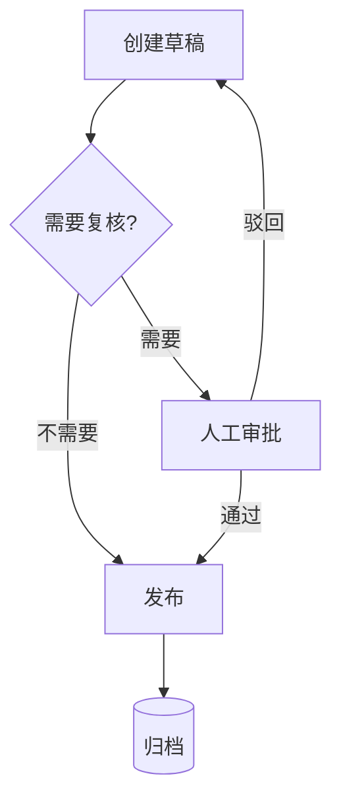
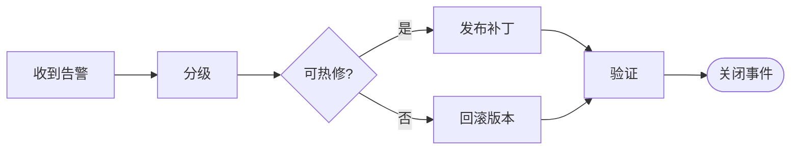

# Mermaid 多图样例

## 业务流程

```mermaid
flowchart TD
    Draft[创建草稿] --> Review{需要复核?}
    Review -->|需要| Approve[人工审批]
    Review -->|不需要| Publish[发布]
    Approve -->|通过| Publish
    Approve -->|驳回| Draft
    Publish --> Archive[(归档)]
```

## 故障处理

```mermaid
graph LR
    Alert[收到告警] --> Triage[分级]
    Triage --> Hotfix{可热修?}
    Hotfix -->|是| Patch[发布补丁]
    Hotfix -->|否| Rollback[回滚版本]
    Patch --> Verify[验证]
    Rollback --> Verify
    Verify --> Close([关闭事件])
```

